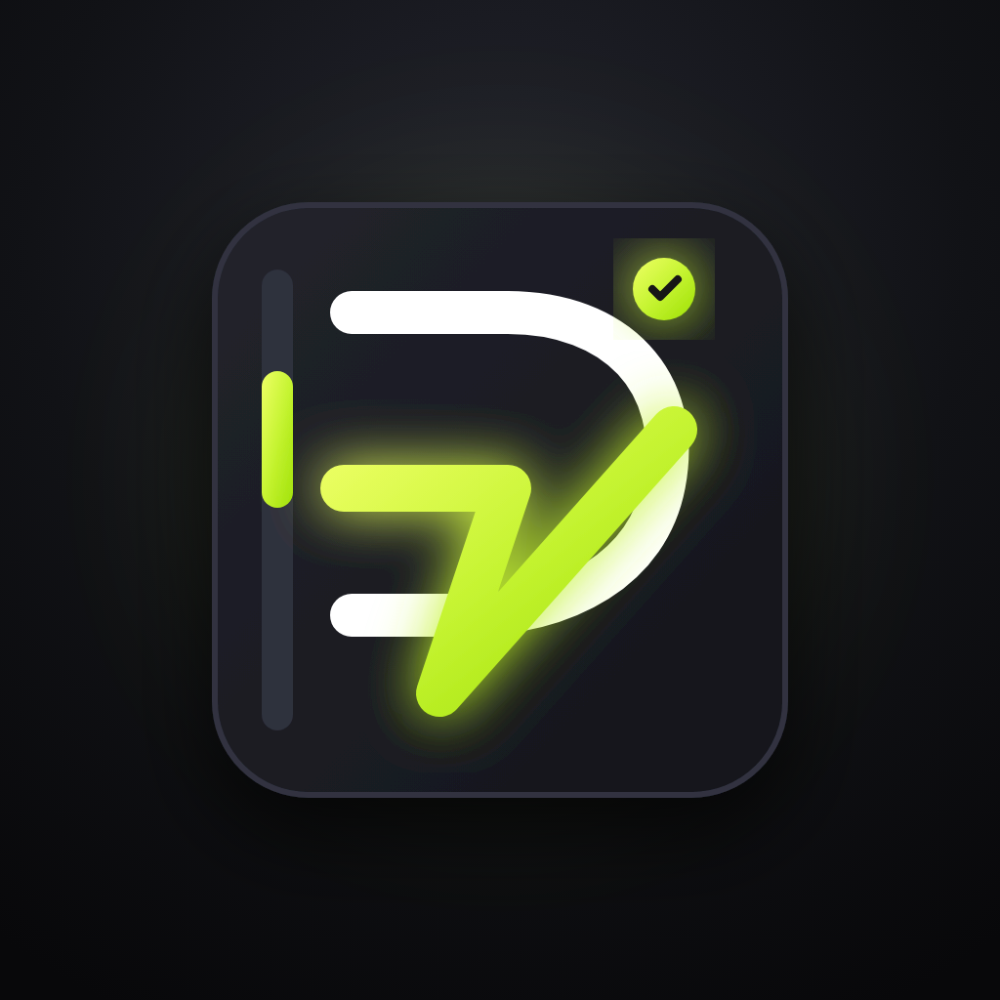

<div align="center">



# Diário Fit

**Treino funcional e de musculação no bolso: monte a semana, siga o cronômetro e acompanhe a evolução.**


[Funcionalidades](#-funcionalidades) •
[Telas](#-telas) •
[Como rodar](#-como-rodar) •
[Arquitetura](#-arquitetura) •
[Design](#-design) •
[Roadmap](#-roadmap)

</div>

---

## ✨ Funcionalidades

| | Recurso | Descrição |
|---|---|---|
| 📅 | **Cronograma semanal** | Monte cada dia com exercícios do catálogo, copie um dia para outros e limpe o dia ou a semana inteira. |
| 🏋️ | **Dois tipos de treino** | Funcional (rodadas × tempo) e hipertrofia (séries × repetições), com descanso configurável por dia. |
| ⚡ | **Treinos prontos** | Planos para iniciantes aplicados com um toque. |
| ⏱️ | **Player de treino** | Cronômetro, descanso com contagem regressiva, vibração, tela sempre acesa, ajuste de carga e troca de exercício por um parecido durante o treino. |
| 📲 | **Segundo plano** | O cronômetro segue pelo relógio real; no Android, uma notificação mostra a contagem ao vivo e avisa cada troca de fase. |
| 🔥 | **Histórico** | Calendário de treinos e contagem de dias seguidos. |
| 📈 | **Perfil** | Peso ao longo do tempo, IMC e progresso até a meta. |
| 🔔 | **Lembretes** | Notificação nos dias que têm treino. |
| 💾 | **Offline-first** | Tudo fica salvo no aparelho e a sessão continua aberta entre um uso e outro. |
| 🔒 | **LGPD** | Termos de uso, política de privacidade e opção de excluir a conta. |

## 📱 Telas

> Protótipos de referência do design (gerados no Stitch), em [`telas app/`](telas%20app/).

<div align="center">
<table>
  <tr>
    <td align="center"><br/><sub>Boas-vindas</sub></td>
    <td align="center"><br/><sub>Criar conta</sub></td>
    <td align="center"><br/><sub>Login</sub></td>
  </tr>
  <tr>
    <td align="center"><br/><sub>O que treinar hoje</sub></td>
    <td align="center"><br/><sub>Lista de exercícios</sub></td>
    <td align="center"><br/><sub>Player de treino</sub></td>
  </tr>
</table>
</div>

## 🚀 Como rodar

**Pré-requisitos:** [Flutter](https://docs.flutter.dev/get-started/install) com Dart `^3.12` e um emulador ou aparelho conectado.

```sh
git clone https://github.com/rafaellourenco10/app_gestao_muscular.git
cd app_gestao_muscular
flutter pub get
flutter run
```

**Qualidade:**

```sh
flutter test      # regras de negócio, persistência e player
flutter analyze   # lints (flutter_lints)
```

**Build de release (Android):**

```sh
flutter build apk --release
```

## 🧱 Arquitetura

Flutter puro, sem gerenciador de estado externo: os dados vivem em modelos simples e são persistidos como JSON.

```
lib/
├── main.dart        abertura do app: carrega os dados e escolhe a primeira tela
├── data.dart        modelos, catálogo de exercícios e regras (sequência, IMC, metas)
├── storage.dart     salvar/carregar tudo como JSON (shared_preferences)
├── reminders.dart   lembretes com notificação local
├── ui.dart          tema "Kinetic Volt" e componentes compartilhados
└── screens/         uma tela por arquivo
assets/
├── icon/            fontes SVG e PNGs do ícone e da splash
└── logo_mark.png    monograma usado no logo dentro do app
telas app/           telas de referência do design e o ícone original
test/                testes de regras, persistência e player
```

### Stack

| Pacote | Uso |
|---|---|
| [`shared_preferences`](https://pub.dev/packages/shared_preferences) | Persistência local |
| [`flutter_local_notifications`](https://pub.dev/packages/flutter_local_notifications) + [`timezone`](https://pub.dev/packages/timezone) | Lembretes e cronômetro em segundo plano |
| [`wakelock_plus`](https://pub.dev/packages/wakelock_plus) | Tela acesa durante o treino |
| [`google_fonts`](https://pub.dev/packages/google_fonts) | Space Grotesk e Inter |
| [`flutter_launcher_icons`](https://pub.dev/packages/flutter_launcher_icons) / [`flutter_native_splash`](https://pub.dev/packages/flutter_native_splash) | Ícone e tela de abertura |

## 🎨 Design

Tema escuro **Kinetic Volt** — especificação completa em [`telas app/kinetic_volt/DESIGN.md`](telas%20app/kinetic_volt/DESIGN.md).

| Token | Cor | |
|---|---|---|
| Fundo | `#0F0F12` |  |
| Superfície | `#18181E` |  |
| Destaque (lime) | `#C6F432` |  |
| Texto | `#E2E2EA` |  |

Tipografia: **Space Grotesk** nos títulos e **Inter** no corpo.

### Ícone e splash

As fontes ficam em `assets/icon/*.svg`. Depois de alterar os PNGs, gere tudo de novo:

```sh
dart run flutter_launcher_icons
dart run flutter_native_splash:create
```

O ícone das notificações (`android/app/src/main/res/drawable-*/ic_notification.png`) é a silhueta branca de `assets/icon/notification.svg`.

## 🗺️ Roadmap

- [x] Cronograma semanal, player e histórico
- [x] Persistência local e sessão mantida
- [x] Cronômetro em segundo plano com notificação ao vivo
- [ ] Backend no Supabase (login real e sincronização) — pontos de integração marcados com `TODO(supabase)`
- [ ] Vídeos dos exercícios no player
- [ ] Imagens próprias no lugar das temporárias

---

<div align="center">
<sub>Feito com Flutter por <a href="https://github.com/rafaellourenco10">@rafaellourenco10</a></sub>
</div>
